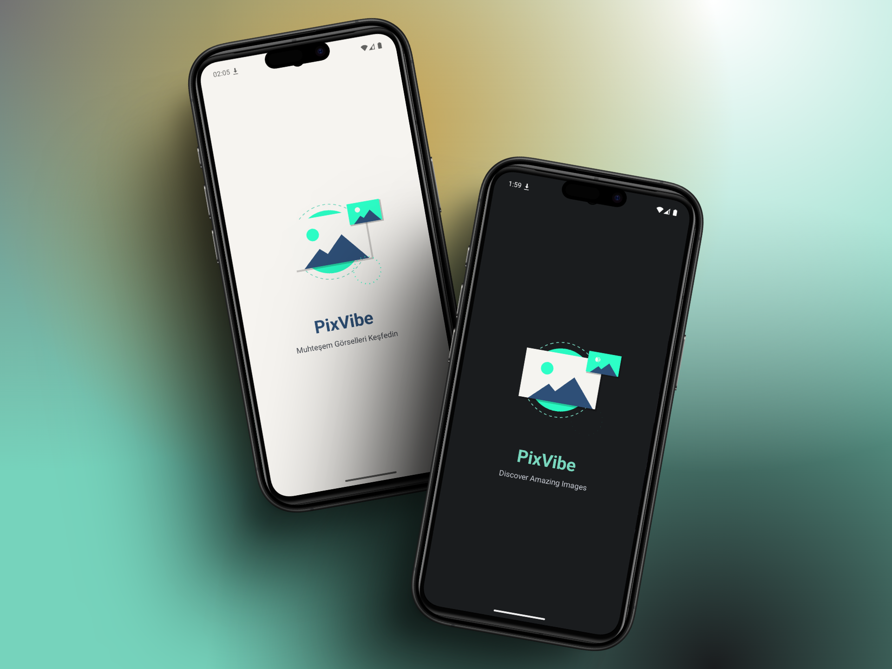
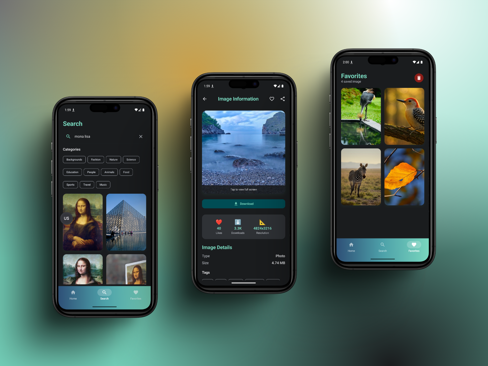
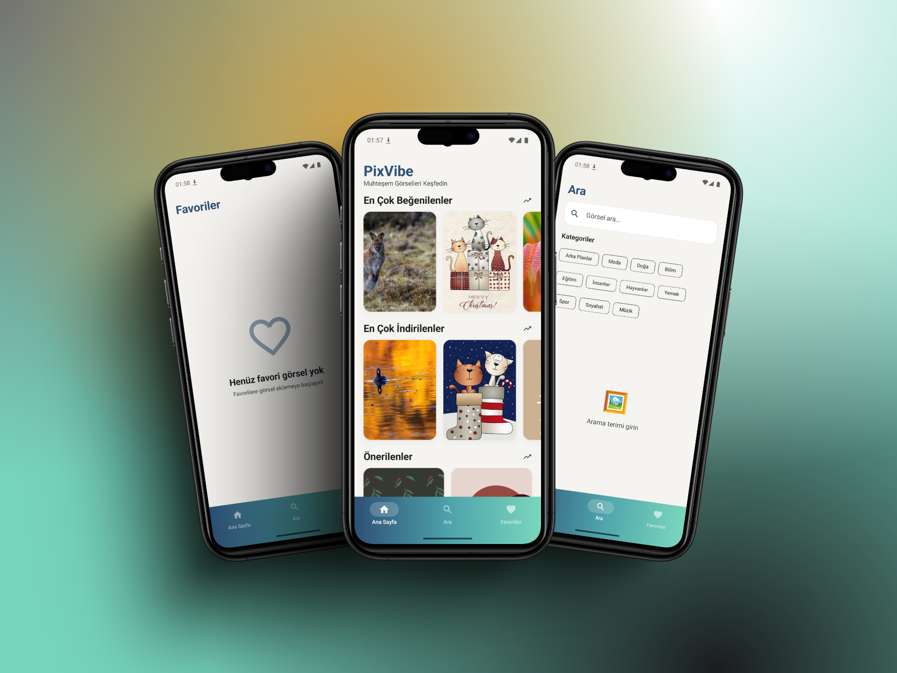

# PixVibe 🖼️

**PixVibe** is a modern Android image discovery application that provides users with access to millions of high-quality images from Pixabay. Built with cutting-edge Android development technologies, it offers an intuitive way to explore trending images, search for specific content, and manage personal favorites with a sleek, vibrant interface.

## 📸 Screenshots







## ✨ Features

* 🖼️ **Image Discovery**: Browse most liked, most downloaded, and recommended images
* 🔍 **Advanced Search**: Find images by keywords with category-based filtering
* ❤️ **Favorites Management**: Save and organize your favorite images locally
* 📱 **Image Details**: View comprehensive image information including resolution and tags
* 🎨 **Modern UI**: Beautiful interface built with Jetpack Compose and Material Design 3
* 🌓 **Dark & Light Theme**: Seamless theme switching with custom color palette
* 🌍 **Multi-language Support**: Turkish and English language support
* 🎬 **Animated Splash Screen**: Engaging Lottie animation on app startup
* 🌈 **Gradient Navigation**: Eye-catching gradient bottom navigation bar
* 📶 **Pull-to-Refresh**: Swipe down to refresh image lists
* 💾 **Download & Share**: Save images and share with others

## 🛠️ Tech Stack

* **Jetpack Compose** - Modern declarative UI
* **MVVM + Clean Architecture** - Separation of concerns
* **Dagger Hilt** - Dependency injection
* **Room Database** - Local data persistence
* **Retrofit + OkHttp** - Networking
* **Coroutines + Flow** - Asynchronous operations
* **Material Design 3** - Custom theming
* **Coil** - Image loading
* **Lottie** - Animations

## 🌐 API Integration

The app integrates with **Pixabay API** to fetch high-quality images.

### Setting up API Key

1. Get your free API key from [Pixabay API](https://pixabay.com/api/docs/)

2. Create a `local.properties` file in your project root:
```properties
   PIXABAY_API_KEY=your_api_key_here
```

3. The app securely accesses the API key using BuildConfig:
```kotlin
   val localProperties = Properties()
   val localPropertiesFile = rootProject.file("local.properties")
   if (localPropertiesFile.exists()) {
       localPropertiesFile.inputStream().use { localProperties.load(it) }
   }

   buildConfigField("String", "PIXABAY_API_KEY", "\"${localProperties.getProperty("PIXABAY_API_KEY")}\"")
```

**Note**: `local.properties` is ignored by Git to keep your API key secure.

## 🏗️ Architecture

The app follows **Clean Architecture** with three distinct layers:

* **Data Layer**: API services, Room database, repositories
* **Domain Layer**: Use cases and business logic
* **Presentation Layer**: Compose UI screens and ViewModels

## 🚀 Getting Started

1. Clone the repository
```bash
   git clone https://github.com/altanbkoc/PixVibe.git
```

2. Get your Pixabay API key from [Pixabay API](https://pixabay.com/api/docs/)

3. Create `local.properties` in project root:
```properties
   PIXABAY_API_KEY=your_api_key_here
```

4. Open in Android Studio and sync

5. Run the app

## 📱 Screens

* 🎬 **Splash Screen** - Animated introduction
* 🏠 **Home Screen** - Trending images in multiple sections
* 🔍 **Search Screen** - Search with 11+ category filters
* ❤️ **Favorites Screen** - Saved images with bulk delete
* 📄 **Detail Screen** - Full image information
* 🖼️ **Full-Screen Viewer** - Immersive viewing experience

## 🔒 Security

* API keys stored securely in `local.properties` (excluded from version control)
* BuildConfig for secure credential access
* HTTPS only communication

## 🤝 Contributing

Contributions are welcome! Please open an issue first to discuss major changes.

1. Fork the Project
2. Create your Feature Branch (`git checkout -b feature/AmazingFeature`)
3. Commit your Changes (`git commit -m 'Add some AmazingFeature'`)
4. Push to the Branch (`git push origin feature/AmazingFeature`)
5. Open a Pull Request

## 📄 License

This project is licensed under the MIT License - see the [LICENSE](LICENSE) file for details.

## 👨‍💻 Developer

**Altan Koç**
* GitHub: [@altanbkoc](https://github.com/altanbkoc)

## 🙏 Acknowledgments

* **Pixabay** for the comprehensive image API
* **Jetpack Compose** team for the modern UI toolkit

---

⭐ **If you found this project helpful, please give it a star!** ⭐

---

*Built with ❤️ using Kotlin and Jetpack Compose*
